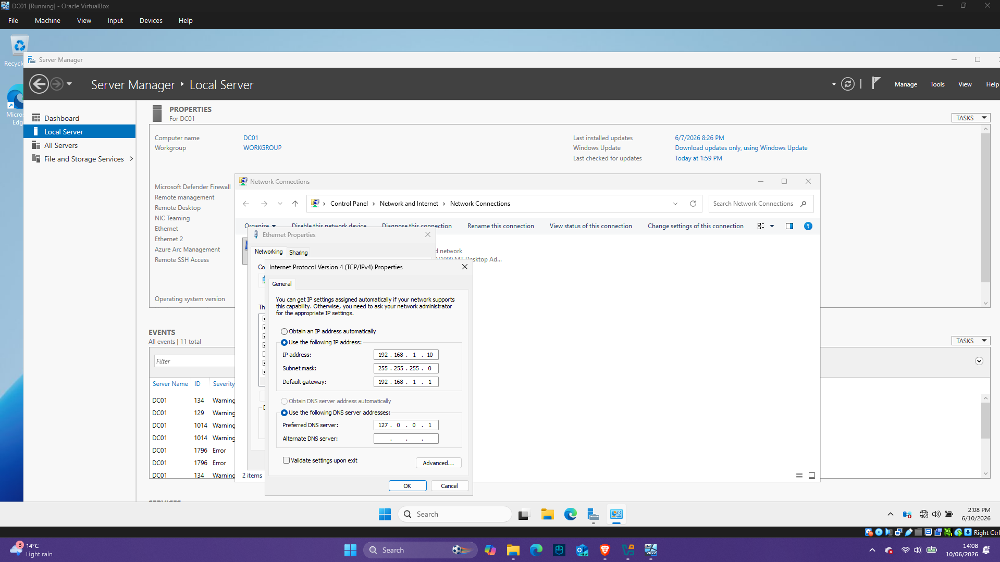

## Objective

- Prepare the server for Active Directory installation.

## Actions Performed
- Renamed server to DC01
- Configured static IP address
## Result

Server is ready for Active Directory.

