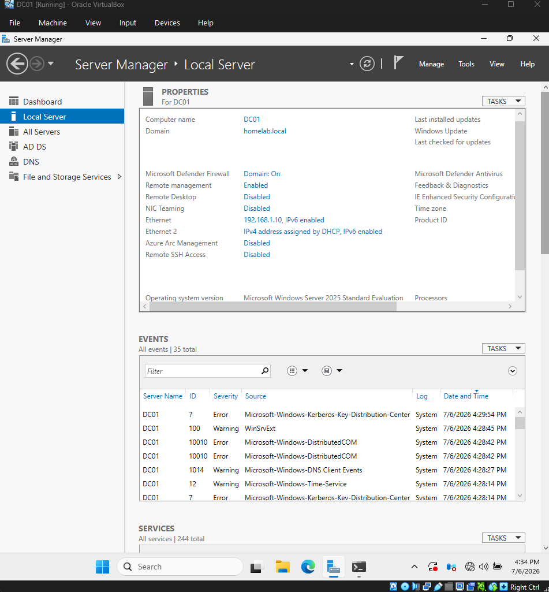
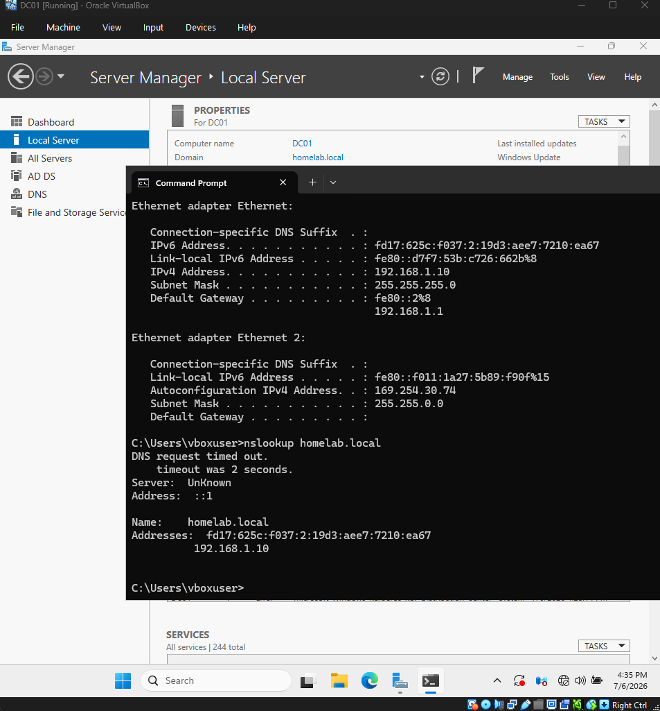

## Objective

Install Active Directory and create a domain.

## Actions Performed
- Installed AD DS role
- Promoted server to Domain Controller
- Created homelab.local
## Result

Active Directory operational and Domain created.

