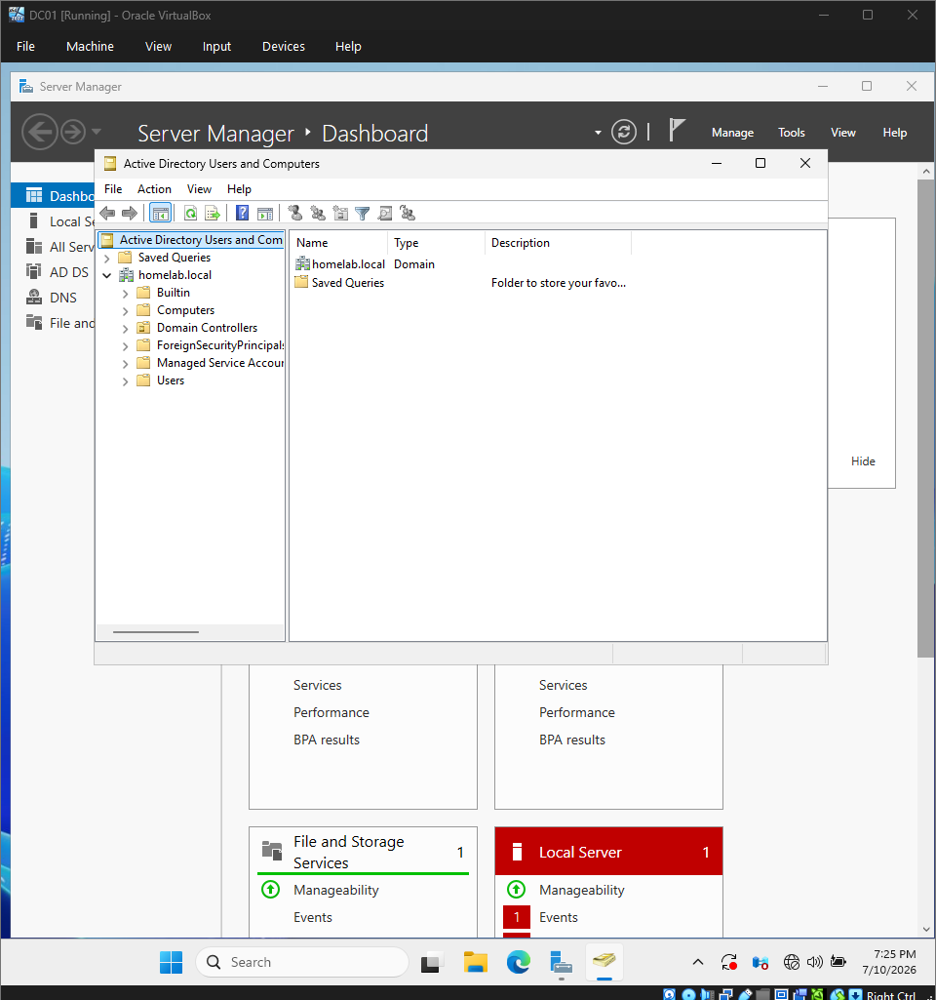
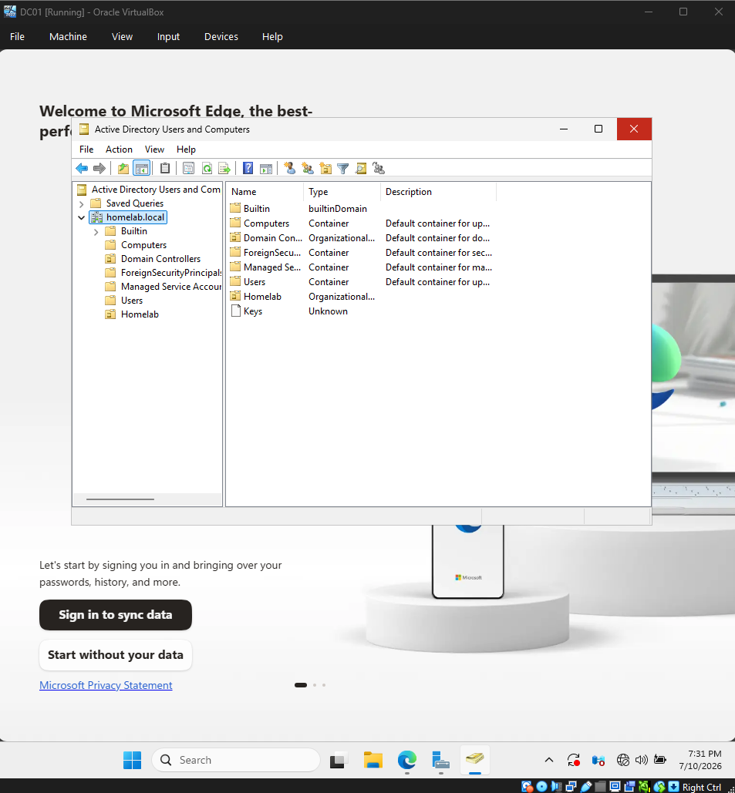
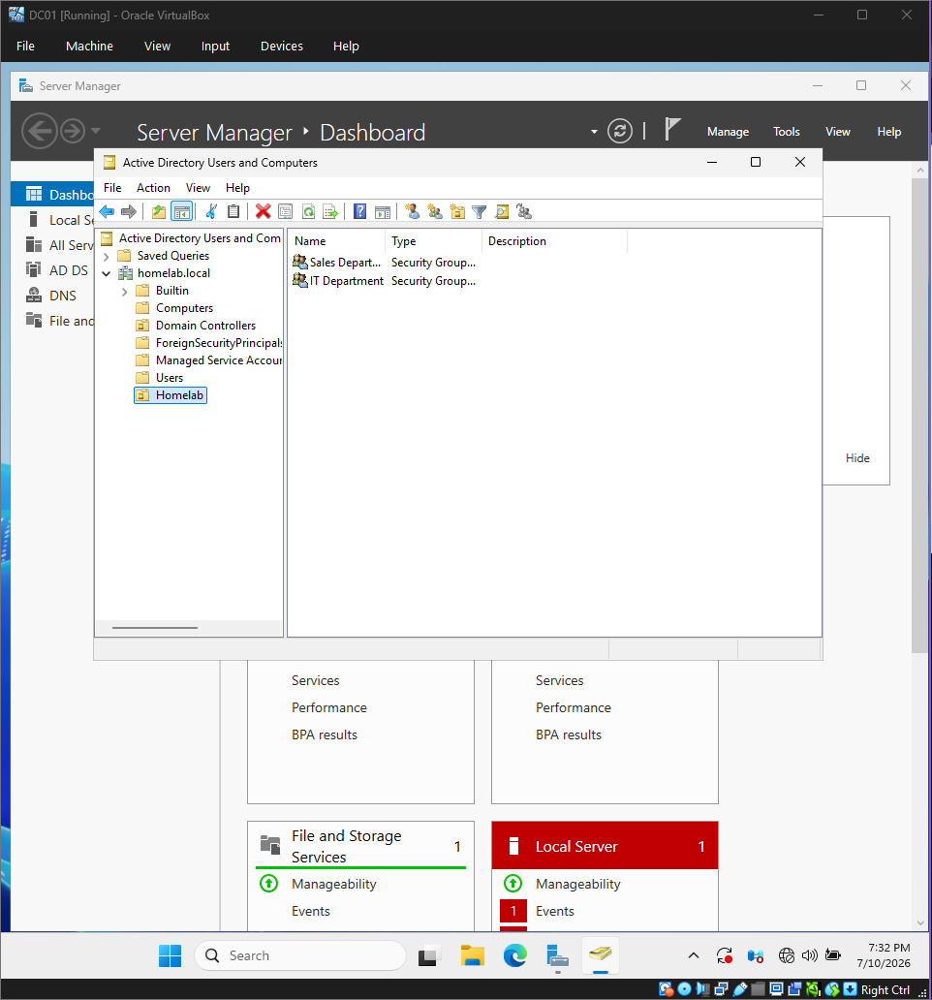

# Organizational Units
## Objective

The objective of this phase was to organise the Active Directory environment by creating Organizational Units (OUs). Rather than storing every object in the default containers, OUs provide a logical structure that makes administration easier and prepares the environment for future Group Policies.

## What are Organizational Units?

- Organizational Units (OUs) are containers within Active Directory that are used to organise objects such as users, computers, and groups.
- Unlike the default Users and Computers containers, OUs can have Group Policies linked to them and administrative control delegated to specific users. This makes them a fundamental part of Active Directory administration.
- In most business environments, OUs are designed to reflect the organisation's departments, locations, or device types.

## Why are OUs Important?

- Without OUs, every user and computer would exist in the same location, making the environment difficult to manage.

## Using OUs allows administrators to:

- Organise users logically.
- Separate departments.
- Apply different Group Policies to different parts of the business.
- Delegate administrative permissions.
- Simplify future management as the organisation grows.
- Planning the OU Structure

## Each OU has a specific purpose.

- Users stores standard user accounts.
- Computers stores domain-joined workstations.
- Servers stores server objects.
- IT and Sales represent different departments.

## Creating this structure now will make it easier to manage users and apply department-specific Group Policies later in the project.

## Implementation

I opened Active Directory Users and Computers and created a new parent Organizational Unit named Homelab.

Inside this parent OU, I created two child Organizational Units:

- IT
- Sales

This created a logical hierarchy that will be used throughout the remainder of the project.

## Screenshots
Default Active Directory Structure

Creating the Parent OU

Completed OU Structure

## Verification

### To verify the configuration was successful, I confirmed that:

The Homelab OU appeared in Active Directory.
Two child OUs were created successfully.

No errors occurred during creation.

## What I Learned

- Through this phase I learned that Organizational Units are much more than folders.
- They provide the structure that Active Directory relies on for administration, delegation, and Group Policy.
- I also learned that planning the OU hierarchy before creating users makes future administration significantly easier.
