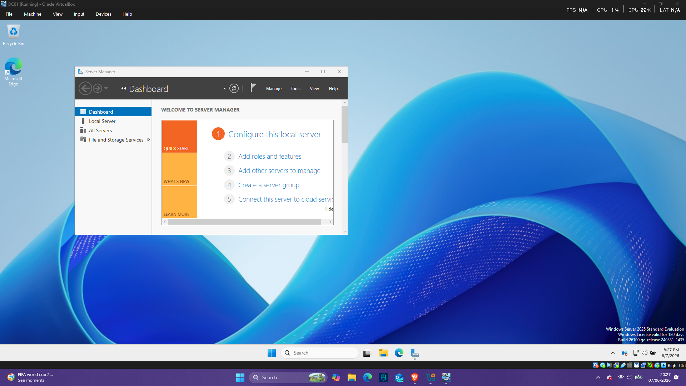

# Objective

## Install Windows Server 2025 on a virtual machine.

## Environment
- VirtualBox
- Windows Server 2025 Standard Evaluation (Desktop Experience)
  
## Result

- Windows Server installed successfully.

